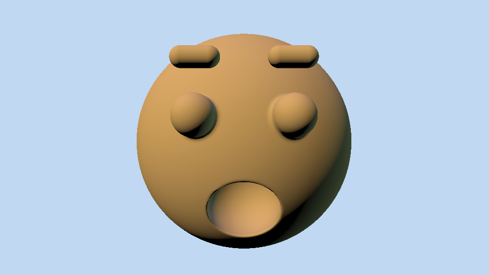
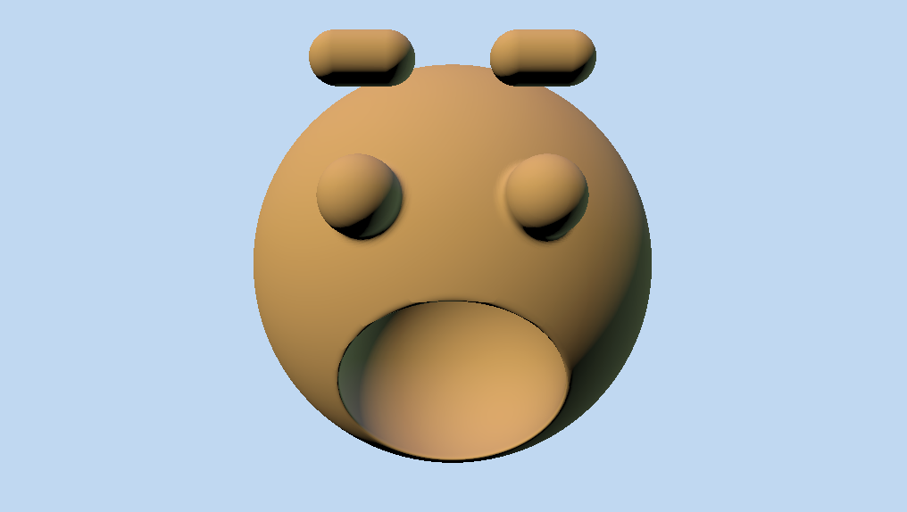
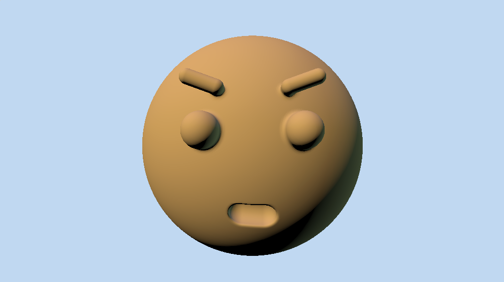
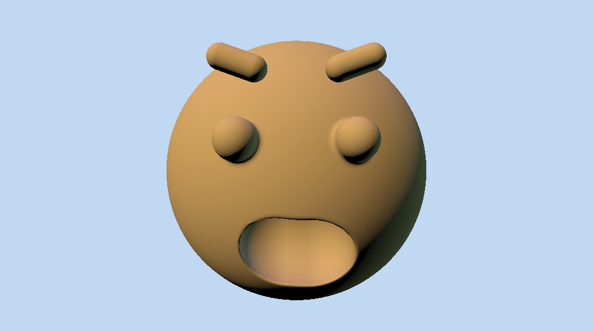
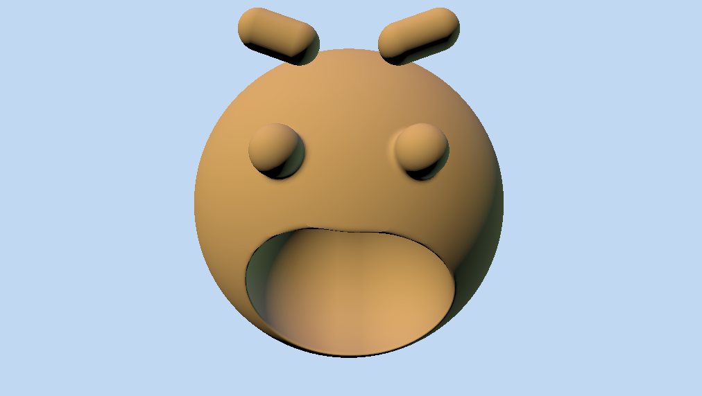
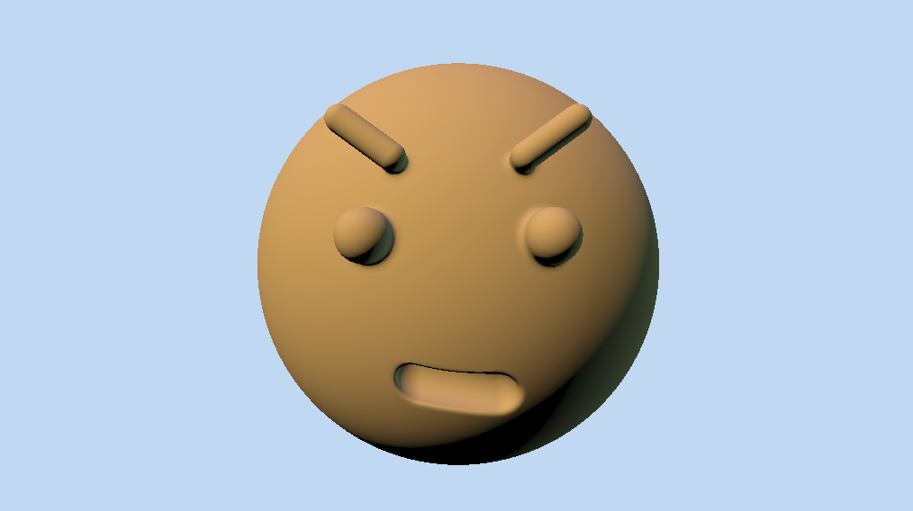
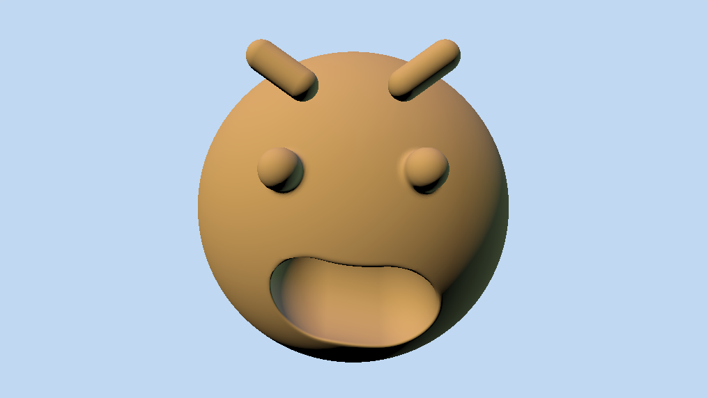
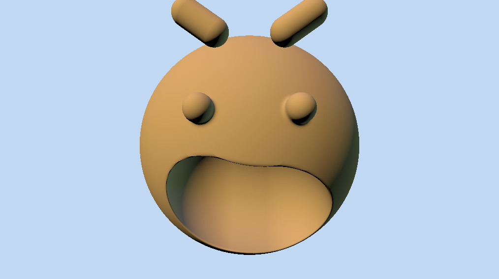

# lab06-proceduralFace

In this lab I practice parameterization by making emotion parameters for a procedural gingerbread man face in [this](https://www.shadertoy.com/view/t3BBDV) shadertoy project.

I add two parameters called SURPRISE and ANGER that can take values from 0 to 1 and modify the face based on how extreme the emotion is. Here are some of the results!

||||
|:--:|:--:|:--:|
| *Surprise: 0, Anger: 0* | *Surprise: 0.5, Anger: 0* | *Surprise: 1, Anger: 0* |
||||
| *Surprise: 0, Anger: 0.5* | *Surprise: 0.5, Anger: 0.5* | *Surprise: 1, Anger: 0.5* |
||||
| *Surprise: 0, Anger: 1* | *Surprise: 0.5, Anger: 1* | *Surprise: 1, Anger: 1* |
